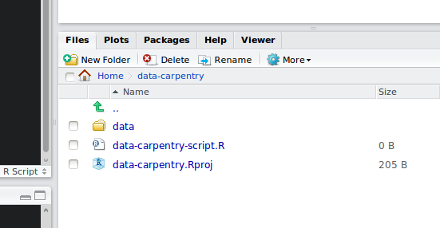

```{r, echo=FALSE, purl=FALSE}
knitr::opts_chunk$set(results='hide', fig.path='img/r-lesson-')
```

> ## Learning Objectives
>
> * Articulating motivations for this lesson
> * Introduce participants to the RStudio interface
> * Set up participants to have a working directory with a `data/` folder inside
> * Introduce R syntax
> * Point to relevant information on how to get help, and understand how to ask well formulated questions

# Demonstration of what we will learn to do

# Before we get started

* Start RStudio (presentation of RStudio -below- should happen here)
* Under the `File` menu, click on `New project`, choose `New directory`, then
  `Empty project`
* Enter a name for this new folder, and choose a convenient location for
  it. This will be your **working directory** for the rest of the day
  (e.g., `~/data-carpentry`)
* Click on "Create project"
* Under the `Files` tab on the right of the screen, click on `New Folder` and
  create a folder named `data` within your newly created working directory.
  (e.g., `~/data-carpentry/data`)
* Create a new R script (File > New File > R script) and save it in your working
  directory (e.g. `data-carpentry-script.R`)

Your working directory should now look like this:



# Presentation of RStudio

Let's start by learning about our tool.

_Point out the different windows in R._

* Console, Scripts, Environments, Plots
* Avoid using shortcuts.
* Code and workflow is more reproducible if we can document everything that we
  do.
* Our end goal is not just to "do stuff" but to do it in a way that anyone can
  easily and exactly replicate our workflow and results.

# Basics of R

R is a versatile, open source programming/scripting language that's useful both
for statistics but also data science. Inspired by the programming language S.

* Open source software under GPL.
* Superior (if not just comparable) to commercial alternatives. R has over 7,000
  user contributed packages at this time. It's widely used both in academia and
  industry.
* Available on all platforms.
* Not just for statistics, but also general purpose programming.
* Is object oriented and functional.
* Large and growing community of peers.

## Commenting

Use `#` signs to comment. Comment liberally in your R scripts. Anything to the
right of a `#` is ignored by R.

## Assignment operator

`<-` is the assignment operator. Assigns values on the right to objects on the
left, it is like an arrow that points from the value to the object.

Many people use `=`, which works almost the same way. Some programmers have
strong opinions about which is better.  It's really a matter of preference.

`=` should is also used to specify the values of arguments in functions for
instance `read.csv(file="data/some_data.csv").`

In RStudio, typing `Alt + -` (push `Alt`, the key next to your space bar at the
same time as the `-` key) will write ` <- ` in a single keystroke.

## Functions and their arguments

Let's look at a simple function call:

```{r, eval=FALSE}
surveys <- read.csv(file="data/surveys.csv")
```

The `file=` part inside the parentheses is called an argument, and most
functions use arguments. Arguments modify the behavior of the
function. Typically, they take some input (e.g., some data, an object) and other
options to change what the function will return, or how to treat the data
provided.

Most functions can take several arguments, but most are specified by default so
you don't have to enter them. To see these default values, you can either type
`args(read.csv)` or look at the help for this function (e.g., `?read.csv`).

```{r, results='show'}
args(read.csv)
```

If you provide the arguments in the exact same order as they are defined you
don't have to name them:

```{r, eval=FALSE}
read.csv(file="data/surveys.csv", header=TRUE) # is identical to:
read.csv("data/surveys.csv", TRUE)
```

However, it's usually not recommended practice because it's a lot of remembering
to do, and if you share your code with others that includes less known functions
it makes your code difficult to read. (It's however OK to not include the names
of the arguments for basic functions like `mean`, `min`, etc...)

Another advantage of naming arguments, is that the order doesn't matter:

```{r, eval=FALSE}
read.csv(file="data/surveys.csv", header=TRUE) # is identical to:
read.csv(header=TRUE, file="data/surveys.csv")
```


## Good practices

There are two main ways of interacting with R: using the console or by using
script files (plain text files that contain your code).

The recommended approach when working on a data analysis project is dubbed "the
source code is real". The objects you are creating should be seen as disposable
as they are the direct realization of your code. Every object in your analysis
can be recreated from your code, and all steps are documented. Therefore, it is
best to enter as little commands as possible in the R console. Instead, all code
should be written in script files, and evaluated from there. That is where
RStudio is really useful as it makes the passing of code between your script and
the R console easy. The R console should be used to inspect objects, test a
function or get help. With this approach, the `.Rhistory` file automatically
created during your session should not be very useful.

Similarly, you should separate the original data (raw data) from intermediate
datasets that you may create for the need of a particular analysis. For
instance, you may want to create a `data/` directory within your working
directory that stores the raw data, and have a `data_output/` directory for
intermediate datasets and a `figure_output/` directory for the plots you will
generate.

## Seeking help

### I know the name of the function I want to use, but I'm not sure how to use it

If you need help with a specific function, let's say `barplot()`, you can type:

```{r, eval=FALSE}
?barplot
```

If you just need to remind yourself of the names of the arguments, you can use:

```{r, eval=FALSE}
args(lm)
```

If the function is part of a package that is installed on your computer but
don't remember which one, you can type:

```{r, eval=FALSE}
??geom_point
```

### I want to use a function that does X, there must be a function or it but I don't know which one...

If you are looking for a function to do a particular task, you can use
`help.search()` (but only looks through the installed packages):

```{r, eval=FALSE}
help.search("kruskal")
```

If you can't find what you are looking for, you can use the
[rdocumention.org](http://www.rdocumentation.org) website that search through
the help files across all packages available.

**We will get into more detail on getting help on more complex problems and 
*problem solving*  at the end of the class.**
